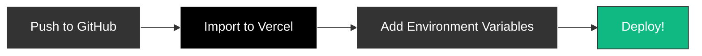

<div align="center">

# The Reading Room

### What started as a simple hobby between friends turned into an ecosystem for literacy within our circle.

[](https://nextjs.org/)
[](https://typescriptlang.org/)
[](https://tailwindcss.com/)
[](https://supabase.com/)
[](LICENSE)

*A beautiful, open-source book club platform designed to bring people together through reading.*

[Getting Started](#-quick-start) · [Features](#-features) · [How It Works](#-how-the-picker-works) · [Deploy](#-deploy-to-vercel)

</div>

---

## The Story

We wanted a way to pick books fairly, track what we'd read together, and have meaningful discussions. Every book club app we found was either too complex or too bare-bones. So we built **The Reading Room**—a warm, inviting space that treats reading as the communal experience it should be.

<table>
<tr>
<td width="33%" align="center">
<h3>📊 Tufte-Inspired</h3>
<p>The data IS the graphic. Our bookshelf shows progress as actual book spines.</p>
</td>
<td width="33%" align="center">
<h3>🏛️ Library Aesthetic</h3>
<p>Brass, walnut, and cream tones that feel like a cozy reading nook.</p>
</td>
<td width="33%" align="center">
<h3>🎲 Fair Randomization</h3>
<p>Series order is sacred. No spoilers, no confusion.</p>
</td>
</tr>
</table>

---

## ✨ Features

| Feature | Description |
|---------|-------------|
| 🎰 **Smart Book Picking** | Random draws for standalones, enforced order for series |
| 📚 **Visual Bookshelf** | Watch your shelf fill with book spines as you progress |
| 🔗 **Series Intelligence** | Pilot book decisions, pause/resume, never spoil order |
| 💬 **Shared Remarks** | Leave notes and ratings on books you've finished |
| 🎬 **Spotlight Section** | Feature movies, podcasts, and discussion questions |
| 🤖 **Discord Integration** | Announce picks automatically to your server |
| ⚡ **Real-time Sync** | Powered by Supabase, works across all devices |

---

## 🔄 How the Picker Works


---

## 🏗️ Architecture


---

## 🚀 Quick Start

### 1. Clone & Install

```bash
git clone https://github.com/DevontiaW/reading-room-template.git
cd reading-room-template
npm install
```

### 2. Configure Environment

```bash
cp .env.example .env.local
```

### 3. Add Your Books

Edit `data/books.json`:

```json
{
  "id": "unique-slug",
  "title": "Your Book Title",
  "author": "Author Name",
  "genres": ["Fiction", "Mystery"],
  "series": null
}
```

For series:

```json
{
  "series": {
    "name": "Series Name",
    "order": 1,
    "total": 3
  }
}
```

### 4. Run

```bash
npm run dev
```

Open [http://localhost:3000](http://localhost:3000)

---

## ☁️ Deploy to Vercel



Or use the CLI:

```bash
npx vercel --prod
```

---

## 🔧 Environment Variables

| Variable | Required | Description |
|----------|----------|-------------|
| `NEXT_PUBLIC_SUPABASE_URL` | Yes | Your Supabase project URL |
| `NEXT_PUBLIC_SUPABASE_ANON_KEY` | Yes | Supabase anonymous key |
| `DISCORD_WEBHOOK_URL` | No | Discord channel webhook for announcements |
| `ALLOWED_USER_IDS` | No | Comma-separated user IDs for auth |

---

## 📁 Project Structure

```
reading-room/
├── 📂 data/
│   └── books.json           # Your book list
├── 📂 src/
│   ├── 📂 app/              # Next.js pages & API routes
│   ├── 📂 components/       # React components
│   └── 📂 lib/              # Core logic, hooks, utilities
├── 📂 public/               # Static assets
├── 📂 supabase/             # Database migrations
└── 📄 .env.example          # Environment template
```

---

## 🤝 Contributing

We welcome contributions! Whether it's:

- 🐛 Bug fixes
- ✨ New features
- 🎨 Design improvements
- 📝 Documentation

Open an issue or submit a PR.

---

## 📄 License

MIT - Use it, modify it, share it. Build your own reading community.

---

<div align="center">

**Built with love for readers, by readers.**

[⬆ Back to Top](#the-reading-room)

</div>
